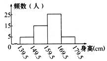

##直方图histogram
[TH1官网链接](https://root.cern.ch/doc/master/classTH1.html)  
直方图是ROOT里面最常用的一个工具。直方图的概念也很简单，我们以一维直方图TH1D为例来说明.
假设一个班级有50人，他们的身高怎么分布的？我们就可以用一个最简单的直方图表示如下：
  
其中横轴是身高，纵轴是统计数目。实验上的直方图跟这个是一样的道理，只不过实验上的事例数一般多得多.  
再理解了直方图后我们介绍ROOT的直方图.
ROOT中是所有类都以T开头，TH1中的H表示Histogram，1表示一维直方图，后面的C,S,I,F,D表示数据类型，比如TH1D表示双精度的一维直方图。
自然想到还会有TH2,TH3等，他们的具体含义跟TH1类似。具体信息查看本节开头给的链接。我们一般常用TH1D,以后的栗子也以TH1D举例.  
实验物理中，直方图一般用来表示某种分布，根据直方图可以得到某些我们想要的信息。比如开头我们讲的身高的分布，如果样本到几百几千，
我们可能会发现身高服从高斯分布。再比如在物理实验中，根据末态粒子的不变质量谱的分布，可以推测中间有没有共振态.  
下面我们来讲怎么使用直方图，直接来看一个栗子.  
h1.C  
```
{
TH1D * h = new TH1D("h","histogram",100,-5,5);  
h->FillRandom("gaus",10000);  
h->Draw();  
}  
```
运行root后把上面中间三行代码一行一行输入root中，或者把这五行，包括开头跟结尾的大括号，保存到h1.C文件，然后运行
``
root h1.C
``
将会看到如下所示的直方图：
  
下面一行一行解释:  

